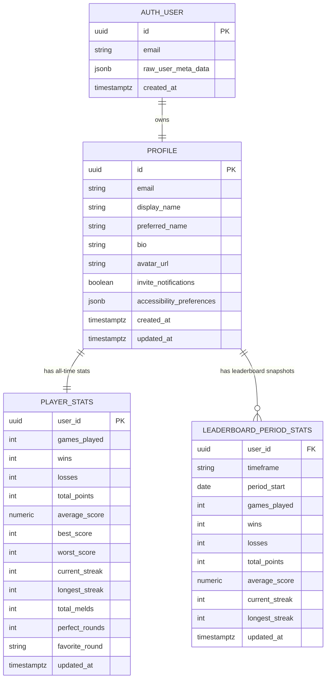

# Supabase Schema

Use Supabase Auth for login storage and the public tables below for profile and leaderboard data.

## Notes

- `auth.users` remains the source of truth for login credentials.
- `public.profiles` stores editable profile data used by the frontend.
- `public.player_stats` stores all-time numbers for stats pages and the all-time leaderboard.
- `public.leaderboard_period_stats` stores precomputed weekly and monthly leaderboard rows.
- Current views expected by the frontend are:
  - `public.leaderboard_all_time`
  - `public.leaderboard_current_weekly`
  - `public.leaderboard_current_monthly`
- Run [docs/supabase_schema.sql](/Users/shreyagarwal/Code/GitHub/shanghai_rummy/docs/supabase_schema.sql) in the Supabase SQL editor to create the schema.
